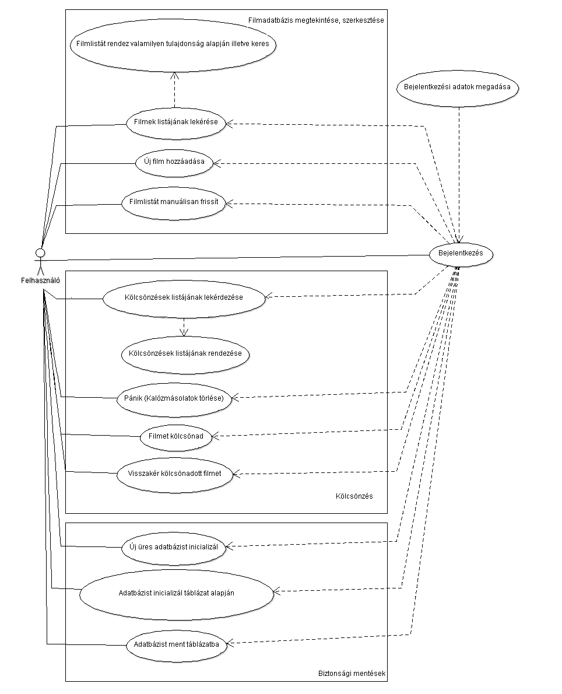

#Documentation
###### Győri Sándor -  AQV5AK
###### alexaegis@gmail.com

##Movie Repository (4. feladat)

###1. Bevezetés
 - A program grafikus felület segítségével enged kezelni egy filmeket nyilvántartó adatbázist. 
 Könnyű keresést és rendezési lehetőségeket biztosít a felhasználó személyes  filmjeihez. 
 Emelett lehetséges vele számontartani filmjeink állapotát úgy mint annak eredetisége és, 
 hogy kinek a birtokában van éppen.  Valamint egy biztonsági funkció segítségével az összes 
 kalózmásolat adatait gyorsan törölhetjük az adatbázisból. Új filmeket, és új kölcsönbeadási 
 eseményeket is felvehetünk melyeket a program az adatbázisban rögzít.
 
###2. Feladatleírás

Készítsünk programot, amellyel otthoni adathordozón lévő filmjeinket tudjuk nyilván tartani az
alábbi funkciókkal:
- Készítsünk egy egyszerű kliens Cache komponenst amely ideiglenes tárolóként
szolgál az adatbázis és az implementált alkalmazás között, a betöltött adatokat tárolja
és egy háttérszálon keresztül megadott időközönként letölti az adatbázisból az utolsó
menet óta létrehozott illetve módosított rekordokat.
- Ezen változásokat jelenítsük meg a megfelelő helyen. (feltételezhetjük, hogy egy adat
szerkesztése közben soha nem módosul az adatbázisban).
- A felhasználói felületen helyezzünk el egy gombot, amely a frissítést azonnal kiváltja.
- A programban megtekinthetőek a filmek egy listában, amelyben tetszőlegesen
kereshetünk cím és/vagy évszám alapján (cím esetén töredékekre is).
- Lehetőségünk van új film felvételére a cím, rendező(k), főszereplő(k), megjelenési év,
valamint az eredetiség (eredeti/kalózmásolat) megadásával. A program figyelmeztet,
ha ugyanezekkel a paraméterekkel már megadtunk egy filmet.
- A filmeket kölcsönadhatjuk barátainknak a film kiválasztásával, valamint a név, a
dátum és a lejárat megadásával. Amennyiben kalózmásolatot adunk kölcsön, a
program figyelmeztessen, és kérjen megerősítést. A program jelenítse meg a lejárt
kölcsönzéseket, és ezt a listát folyamatosan tartsa karban egy háttérszál
segítségével.
- A kölcsönzéseket listázhatjuk (név, dátum), és a listát szűkíthetjük dátum, illetve
név(töredék) megadásával.
- A kölcsönadott filmeket természetesen vissza lehet hozni. A listában külön emeljük ki
(pl. más színnel) azokat a filmeket, amelyeket kölcsönadtunk. Külön oszlopban
jelenítsük meg, összesen hányszor adtuk kölcsön az adott filmet.
- A programban legyen egy PÁNIK gomb is arra az esetre, ha jön a szoftverrendőrség.
Ez a gomb azonnal kitöröl minden olyan filmmel kapcsolatos információt, amely
kalózmásolat.
- Az adatbázis az alábbi adatokat tárolja (ezek még nem feltétlenül a fizikai adattáblák):
    - filmek (cím, rendező(k), főszereplő(k), megjelenés éve, eredetiség)
    - kölcsönzések (film, név, dátum)

####3. Követelményelemzés
- A program bizonyos komponensei külső csomagokat használnak segítségül, ezeket a 
dependenciákat a Maven Central Repository-ból fogjuk beszerezni, a programot pedig 
Maven segítségével fogjuk buildelni.
- A programnak egy mySQL adatbázis kell kezelnie, ehhez JDBC kapcsolatot fogunk használni.
Driverként meg a com.mysql.cj.jdbc.Driver-t fogjuk használni ami a mysql.mysql-connector-java
dependecia fog szolgáltatni.
Emellett pedig opcionálisan lehetőséget biztosítunk távoli adatbázis kezelésére is 
SSH csatornán keresztül, ehhez a com.jcraft.jsch csomagot fogjuk használni.
-

####4. Use Case
- Általános felhasználás

####5. User Stories

## Bejelentkezés

| Actor               | Vendég                                                                             
|:--------------------|:-----------------------------------------------------------------------------------
| Előfeltétel         | Nincs adatbáziskapcsolat                                                           
| Sikertelen Eredmény | A vendég újból megpróbálkozhat a bejelentkezéssel                                  
| Sikeres Eredmény    | A vendég felhasználóvá lép elő, hozzáfér a megadott adatbázishoz                   
| Kiváltja            | A vendég a "Csatlakozás/Connect" gombra kattintott a "Kapcsolat/Connection" menüben
| Események           | 1. A felhasználó megváltoztatja az alapértelmezetten felajánlott adatokat          
|                     |     a) adatbázis címe (alapértelmezett: mysql.caesar.elte.hu)                       
|                     |     b) portja (alapértelmezett: 3306)                                               
|                     |     c) felhasználóneve                                                              
|                     |     d) jelszava                                                                     
|                     | 2. Beállítja, hogy szeretne e SSH portforwardingot amennyiben távoli adatbázist kíván elérni
|                     |     a) kapcsolat címe (alapértelmezetten caesar.elte.hu)                                     
|                     |     b) portja (alapértelmezetten 22)                                                         
|                     |     c) továbbítás célja (alapértelmezetten 127.0.0.1)                                        
|                     |     d) portja (alapértelmezetten 22)                                                         
|                     |     e) felhasználóneve                                                                       
|                     |     f) jelszava                                                                              
|                     | 3. A "Kapcsolódás/Connect" gomb megnyomása után a program megkísérel bejelentkezni a megadott adatokkal az adatbázisba, amennyiben sikerül a filmlista azonnal megjelenik a képernyőn és minden további funkció elérhetővé válik.
|                     | 4. Sikertelen bejelentkezés esetén az okot egy előugró ablakban közöljük a felhasználóval majd lehetősége van újbóli kísérletre
| Kiegészítés         |  A bejelentkezés követelményei:
|                     |     - Nem helyi cím esetén internetkapcsolat
|                     |     - A port mezők csak számokat tartalmazhatnak

##

| Actor               | Felhasználó  |
|:--------------------|:---------------|
| Előfeltétel         | a  |
| Sikertelen Eredmény |   |
| Kiváltja            |   |
| Események           |   |
| Kiegészítés         |   |

 

