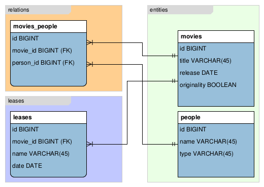

Documentation
=============
###### Győri Sándor - AQV5AK
###### alexaegis@gmail.com

Movie Repository (4. feladat)
-----------------------------

<h2>1. Bevezetés</h2>

A program grafikus felület segítségével enged kezelni egy filmeket nyilvántartó adatbázist. 
Könnyű keresést és rendezési lehetőségeket biztosít a felhasználó személyes  filmjeihez. 
Emelett lehetséges vele számontartani filmjeink állapotát úgy mint annak eredetisége és, 
hogy kinek a birtokában van éppen.  Valamint egy biztonsági funkció segítségével az összes 
kalózmásolat adatait gyorsan törölhetjük az adatbázisból. Új filmeket, és új kölcsönbeadási 
eseményeket is felvehetünk melyeket a program az adatbázisban rögzít. Az adatbázis tartalmáról
pedig a program képes biztonsági másolatot készíteni, esetleg egy üres adatbázis esetén a
megfelelő sémákkal inicializálni azt, biztonsági mentést fájlból betölteni.

<h2>2. Feladatleírás</h2>

Készítsünk programot, amellyel otthoni adathordozón lévő filmjeinket tudjuk nyilván tartani az
alábbi funkciókkal:
- Készítsünk egy egyszerű kliens Cache komponenst amely ideiglenes tárolóként
szolgál az adatbázis és az implementált alkalmazás között, a betöltött adatokat tárolja
és egy háttérszálon keresztül megadott időközönként letölti az adatbázisból az utolsó
menet óta létrehozott illetve módosított rekordokat.
- Ezen változásokat jelenítsük meg a megfelelő helyen. (feltételezhetjük, hogy egy adat
szerkesztése közben soha nem módosul az adatbázisban).
- A felhasználói felületen helyezzünk el egy gombot, amely a frissítést azonnal kiváltja.
- A programban megtekinthetőek a filmek egy listában, amelyben tetszőlegesen
kereshetünk cím és/vagy évszám alapján (cím esetén töredékekre is).
- Lehetőségünk van új film felvételére a cím, rendező(k), főszereplő(k), megjelenési év,
valamint az eredetiség (eredeti/kalózmásolat) megadásával. A program figyelmeztet,
ha ugyanezekkel a paraméterekkel már megadtunk egy filmet.
- A filmeket kölcsönadhatjuk barátainknak a film kiválasztásával, valamint a név, a
dátum és a lejárat megadásával. Amennyiben kalózmásolatot adunk kölcsön, a
program figyelmeztessen, és kérjen megerősítést. A program jelenítse meg a lejárt
kölcsönzéseket, és ezt a listát folyamatosan tartsa karban egy háttérszál
segítségével.
- A kölcsönzéseket listázhatjuk (név, dátum), és a listát szűkíthetjük dátum, illetve
név(töredék) megadásával.
- A kölcsönadott filmeket természetesen vissza lehet hozni. A listában külön emeljük ki
(pl. más színnel) azokat a filmeket, amelyeket kölcsönadtunk. Külön oszlopban
jelenítsük meg, összesen hányszor adtuk kölcsön az adott filmet.
- A programban legyen egy PÁNIK gomb is arra az esetre, ha jön a szoftverrendőrség.
Ez a gomb azonnal kitöröl minden olyan filmmel kapcsolatos információt, amely
kalózmásolat.
- Az adatbázis az alábbi adatokat tárolja (ezek még nem feltétlenül a fizikai adattáblák):
	- filmek (cím, rendező(k), főszereplő(k), megjelenés éve, eredetiség)
	- kölcsönzések (film, név, dátum)

<h2>3. Követelményelemzés</h2>

Egy átlátható és könnyen kezelhető programot fogunk megvalósítani, mely egy futattható állományban
fogja tudni ellátni a feladatait egy adatbázis segítségével. Képes lesz ezt az adatbázist magának megformázni
a felhasználó magának adatokkal feltölteni, akár file-ból is, és az adatbázisban lévő adatokat
biztonsági mentésként ki is mentheti magának. Az adatbázis adatai táblázatos formában fognak megjelenni,
a több adatot tartalmazó elemek (mint a színészek, rendezők) pedig a mezőben egy legördülő menüként jelnnek majd meg
ahol alapértelmezetten az első elem fog látszani. Ha csak egy ilyen mező van akkor egyszerű elemként jelenik meg
A keresés a táblákban valós időben fog zajlani, minden frissült inputra változni fog a lista a keresésnek megfelelően.
Lehetőséget adunk a felhasználónak, hogy távoli adatbázist is tudjon biztonságosan kezel SSH segítségével, így
növelve a program hordozhatóságát. Mivel a programot előre láthatóan használi fogók jelentős része rendelkezik
ELTE-IK-s Caesar-os hozzáféréssel így az ott kapott mySQL adatbázist könnyedén felhasználhatják a programmal.

<h2>4. Funkcionális követelmények</h2>
#### Use Case
Általános felhasználás

 Felülettervezet 

- Teljes ablak

- Connection menu

- Connect window

######***A felülettervezetből hiányoznak az alső keresőmezők, a filmkölcsönzési nézet hasonlóan néz ki szintén alsó keresőmezőkkel és a szükségeseken kívül egy plusz oszloppal melyben a kölcsönbeadás visszavonásához szükséges gomb lesz elhelyezve. A több elemű mezőkhöz legördülő menü fog tartozni. Az ikonok nem véglegesek és nincs mindenhol.***

#### User Stories

##### Filmlistával kapcsolatos User Story-k

<table>
	<tr>
		<th>1</th>
		<th>Bejelentkezés, adatbáziskapcsolat létesítése</th>
	</tr>
		<tr>
		<td>Actor</td>
		<td>Vendég</td>
	</tr>
	<tr>
		<td>Előfeltétel</td>
		<td>Nincs adatbáziskapcsolat</td>
	</tr>
	<tr>
		<td>Sikertelen Eredmény</td>
		<td>A vendég újból megpróbálkozhat a bejelentkezéssel</td>
	</tr>
	<tr>
		<td>Sikeres Edemény</td>
		<td>A vendég felhasználóvá lép elő, hozzáfér a megadott adatbázishoz, a program további funkcióihoz</td>
	</tr>
	<tr>
		<td>Kiváltja</td>
		<td>A vendég a "Csatlakozás/Connect" gombra kattintott a "Kapcsolat/Connection" menüben</td>
	</tr>
	<tr>
		<td>Események</td>
		<td>
			<ol>
				<li>A felhasználó megváltoztatja az alapértelmezetten felajánlott adatokat</li>
				<ul>
					<li>adatbázis címe (alapértelmezett: mysql.caesar.elte.hu)</li>
					<li>portja (alapértelmezett: 3306)   </li>
					<li>felhasználóneve </li>
					<li>jelszava</li>
				</ul>
				<li>Beállítja, hogy szeretne e SSH portforwardingot amennyiben távoli adatbázist kíván elérni</li>
					<ul>
						<li>kapcsolat címe (alapértelmezetten caesar.elte.hu)</li>
						<li>portja (alapértelmezetten 22)</li>
						<li>továbbítás célja (alapértelmezetten 127.0.0.1)</li>
						<li>portja (alapértelmezetten 22)</li>
						<li>felhasználóneve</li>
						<li>jelszava
					</ul>
				<li>A "Kapcsolódás/Connect" gomb megnyomása után a program megkísérel bejelentkezni a megadott 
					adatokkal az adatbázisba, amennyiben sikerül a filmlista azonnal megjelenik a képernyőn és minden 
					további funkció elérhetővé válik.</li>
					<li>Sikertelen bejelentkezés esetén az okot egy előugró ablakban közöljük a felhasználóval 
					majd lehetősége van újbóli kísérletre</li>
			</ol>
	</tr>
	<tr>
		<td>Kiegészítés</td>
		<td>A bejelentkezés követelményei:
			<ul>
					<li>Nem helyi cím esetén internetkapcsolat</li>
					<li>A port mezők csak számokat tartalmazhatnak</li>
			</ul>
		</td>
	</tr>
</table>

<table>
	<tr>
		<th>2</th>
		<th>Filmlista frissítése/lekérése</th>
	</tr>
		<tr>
		<td>Actor</td>
		<td>Felhasználó</td>
	</tr>
	<tr>
		<td>Előfeltétel</td>
		<td>Adatbáziskapcsolat</td>
	</tr>
	<tr>
		<td>Sikertelen Eredmény</td>
		<td>A felhasználó értesítést kap a sikertelen adatlekérésről</td>
	</tr>
	<tr>
		<td>Sikeres Edemény</td>
		<td>Megjelenik a filmlista annak 5 oszlopával az alábbi sorrendben 
		alapértelmezetten a Cím szerint rendezve:
		<ul>
		<li>Cím</li>
		<li>Rendezők listája</li>
		<li>Főszereplők listája</li>
		<li>Megjelenés dátuma</li>
		<li>Eredetiség</li>
		</ul>
		</td>
	</tr>
	<tr>
		<td>Kiváltja</td>
		<td>A vendég sikeresen csatlakozott az adatbázishoz, vagy a "Kapcsolat/Connection" menüben
				a "Frissítés/Update" gombra kattintott</td>
	</tr>
	<tr>
		<td>Események</td>
		<td>
			<ol>
				<li>A felhasználó lekérést intéz az adatbázissal szemben</li>
				<li>Az adatok megjelennek a képernyőn</li>  
			</ol>
	</tr>
</table>

<table>
	<tr>
		<th>3</th>
		<th>Filmlista rendezése, keresés a listában</th>
	</tr>
		<tr>
		<td>Actor</td>
		<td>Felhasználó</td>
	</tr>
	<tr>
		<td>Előfeltétel</td>
		<td>Megjelenített filmlista</td>
	</tr>
	<tr>
		<td>Sikertelen Eredmény</td>
		<td>Nincs megjeleníthető információ a képernyőn</td>
	</tr>
	<tr>
		<td>Sikeres Edemény</td>
		<td>A képernyőn a felhasználó szerinti sorrendben, az ő keresőszavaira reagálva jelennek meg</td>
	</tr>
	<tr>
		<td>Kiváltja</td>
		<td>A rendezés az oszlopok neveinek kattintásával érhető el, növekvő illetve második kattintásra csökkenő 
		sorrendben. A keresés pedig a legalsó sorban lévő üres szövegmezőkkel érhetőek el melyek az inputra
		reagálva folyamatosan frissítik a kijelzett filmlistát</td>
	</tr>
	<tr>
		<td>Események</td>
		<td>
			<ul>
				<li>Rendezés
					<ol>
						<li>A felhasználó rákattint a egyik oszlop címére</li>
						<li>A filmlista a kiválasztott oszlop szerinti növekvő sorrendben rendezésre kerül</li>
						<li>A felhasználó rákattint az oszlop címére ismét</li>
						<li>A filmlista a kiválasztott oszlop szerinti csökkenő sorrendben rendezésre kerül</li>
					</ol>
				</li>
				<li>Keresés
					<ol>
						<li>A felhasználó beírja a keresőszavát az adott oszlop legalsó keresőmezőjébe</li>
						<li>A filmlista minden egyes új begépelt karakterre frissül és a keresett oszlop szerint
						rendezésben jelenik meg a képernyőn</li>
						<li>A felhasználó üresre törli a mezőt a filmlista visszaáll keresés előtti állapotára</li>
					</ol>
				</li>
			</ul>
	</tr>
</table>

<table>
	<tr>
		<th>4</th>
		<th>Új film hozzáadása</th>
	</tr>
		<tr>
		<td>Actor</td>
		<td>Felhasználó</td>
	</tr>
	<tr>
		<td>Előfeltétel</td>
		<td>Adatbáziskapcsolat</td>
	</tr>
	<tr>
		<td>Sikertelen Eredmény</td>
		<td>Az adatbázisban nem történik változtatás, a felhasználó felugró ablakban értesítést kap a
		művelet sikertelenségéről</td>
	</tr>
	<tr>
		<td>Sikeres Edemény</td>
		<td>A film adatai bekerülnek az adatbázisba, a filmlista frissül az új adatokkal</td>
	</tr>
	<tr>
		<td>Kiváltja</td>
		<td>A felhasználó a "Film hozzáadása/Add movie" gombra kattintott a "Filmek/Movies" menüben majd
		helyes adatokkal a film hozzáadási ablakban a "Hozzáad/Add" gombra kattint</td>
	</tr>
	<tr>
		<td>Események</td>
		<td>
			<ol>
				<li>A felhasználó a "Filmek/Movies" gombra kattint, majd a "Film hozzáadása/Add movie" gombra</li>
				<li>A megjelent ablakban felveszi a megfelelő mezőkbe a film adatait:</li>
				<ul>
					<li>Film címe</li>
					<li>Megjelenésének dátuma (YYYY-MM-DD formátumban)</li>
					<li>A film rendezői (ha több van ';'-vel elválasztva)</li>
					<li>A film főszereplői (ha több van ';'-vel elválasztva)</li>
				</ul>
				<li>Majd "Hozzáad/Add" gombra kattint</li>
			</ol>
	</tr>
	<tr>
		<td>Kiegészítés</td>
		<td>
			<li>A film dátumának megadásának lehetőségét később kibővíthetjük, hogy több formátumban, esetleg 
			hónap, nap nélkül is rögzíteni tudjuk</li>
		</td>
	</tr>
</table>

<table>
	<tr>
		<th>5</th>
		<th>Kilépés</th>
	</tr>
		<tr>
		<td>Actor</td>
		<td>Vendég / Felhasználó</td>
	</tr>
	<tr>
		<td>Előfeltétel</td>
		<td>Megnyitott program</td>
	</tr>
	<tr>
		<td>Sikertelen Eredmény</td>
		<td>A program nem kerül bezárásra, az okáról előugró ablak figyelmeztet</td>
	</tr>
	<tr>
		<td>Sikeres Edemény</td>
		<td>A program lezárja az adatbáziskapcsolatokat és leáll</td>
	</tr>
	<tr>
		<td>Kiváltja</td>
		<td>A felhasználó a "Kapcsolat/Connection" menüben a "Leállítás/Exit Application" gombra kattint</td>
	</tr>
	<tr>
		<td>Események</td>
		<td>
			<ol>
				<li>A felhasználó a "Kapcsolat/Connection" menüben a "Leállítás/Exit Application" gombra kattint</li>
				<li>A program leelenőrzi, hogy van e adatbáziskapcsolat, ha van bezárja azt</li>
				<li>A program bezárul</li>
			</ol>
	</tr>
</table>
 
##### Kölcsönzésekkel kapcsolatos User Story-k

<table>
	<tr>
		<th>1</th>
		<th>Kölcsönzések listájának lekérése/frissítése</th>
	</tr>
		<tr>
		<td>Actor</td>
		<td>Felhasználó</td>
	</tr>
	<tr>
		<td>Előfeltétel</td>
		<td>Adatbáziskapcsolat</td>
	</tr>
	<tr>
		<td>Sikertelen Eredmény</td>
		<td>A felhasználó értesítést kap a sikertelen adatlekérésről</td>
	</tr>
	<tr>
		<td>Sikeres Edemény</td>
		<td>Megjelenik a kölcsönzések listája annak X oszlopával az alábbi sorrendben 
		alapértelmezetten a film címe szerint rendezve:
		<ul>
		<li>Cím</li>
		<li>Kölcsönbeadás dátuma</li>
		<li>Kölcsönző neve</li>
		<li>Eredetiség</li>
		</ul>
		</td>
	</tr>
	<tr>
		<td>Kiváltja</td>
		<td>A felhaszáló a "Kölcsönzések" gombra kattintott a menüben</td>
	</tr>
	<tr>
		<td>Események</td>
		<td>
			<ol>
				<li>A felhaszáló a "Kölcsönzések" gombra kattint</li>
				<li>Az adatok megjelennek a képernyőn</li>
			</ol>
	</tr>
</table>

<table>
	<tr>
		<th>2</th>
		<th>Kölcsönzési lista rendezése, keresés a listában</th>
	</tr>
		<tr>
		<td>Actor</td>
		<td>Felhasználó</td>
	</tr>
	<tr>
		<td>Előfeltétel</td>
		<td>Megjelenített kölcsönzési lista</td>
	</tr>
	<tr>
		<td>Sikertelen Eredmény</td>
		<td>Nincs megjeleníthető információ a képernyőn</td>
	</tr>
	<tr>
		<td>Sikeres Edemény</td>
		<td>A képernyőn a felhasználó szerinti sorrendben, az ő keresőszavaira reagálva jelennek meg az adatok</td>
	</tr>
	<tr>
		<td>Kiváltja</td>
		<td>A rendezés az oszlopok neveinek kattintásával érhető el, növekvő illetve második kattintásra csökkenő 
		sorrendben. A keresés pedig a legalsó sorban lévő üres szövegmezőkkel érhetőek el melyek az inputra
		reagálva folyamatosan frissítik a kijelzett kölcsönzési listát</td>
	</tr>
	<tr>
		<td>Események</td>
		<td>
			<ul>
				<li>Rendezés
					<ol>
						<li>A felhasználó rákattint a egyik oszlop címére</li>
						<li>A kölcsönzési lista a kiválasztott oszlop szerinti növekvő sorrendben rendezésre kerül</li>
						<li>A felhasználó rákattint az oszlop címére ismét</li>
						<li>A kölcsönzési lista a kiválasztott oszlop szerinti csökkenő sorrendben rendezésre kerül</li>
					</ol>
				</li>
				<li>Keresés
					<ol>
						<li>A felhasználó beírja a keresőszavát az adott oszlop legalsó keresőmezőjébe</li>
						<li>A kölcsönzési lista minden egyes új begépelt karakterre frissül és a keresett oszlop 
						szerinti rendezésben jelenik meg a képernyőn</li>
						<li>A felhasználó üresre törli a mezőt a filmlista visszaáll keresés előtti állapotára</li>
					</ol>
				</li>
			</ul>
	</tr>
</table>

<table>
	<tr>
		<th>3</th>
		<th>Filmet kölcsönad</th>
	</tr>
		<tr>
		<td>Actor</td>
		<td>Felhasználó</td>
	</tr>
	<tr>
		<td>Előfeltétel</td>
		<td>Megjelenített filmlista</td>
	</tr>
	<tr>
		<td>Sikertelen Eredmény</td>
		<td>A felhasználó értesítést kap a kölcsönbeadás sikertelenségéről és okáról, az adatbázisban 
		változás nem történik</td>
	</tr>
	<tr>
		<td>Sikeres Edemény</td>
		<td>A filmlistából kikerül a film, a kölcsönzések listájában pedig megjelenik. A változatások adatbázis
		szinten történnek</td>
	</tr>
	<tr>
		<td>Kiváltja</td>
		<td>A felhasználó a "Kölcsönbead" gombra kattintott a "Kölcsönzések" menüben</td>
	</tr>
	<tr>
		<td>Események</td>
		<td>
			<ol>
				<li>A felhasználó a "Kölcsönbead" gombra kattintott a "Kölcsönzések" menüben</li>
				<li>A felugró ablakban megadja a megfelelő adatokat</li>
				<ul>
					<li>Film (legördülő menüben jelennek meg a filmlistában szereplő filmek, a mezőben keresni is lehet)</li>
					<li>Kölcsönző neve</li>
					<li>Dátum (alapértelmezetten az aktuális, de lehetőség van korábbi kölcsönzéseket is felvenni)</li>
				</ul>
				<li>A felhasználó a kölcsönbeadás gombra kattint</li>
				<li>A program figyelmeztet ha a film kalózmásolat, további megerősítésre vár</li>
			</ol>
	</tr>
	<tr>
		<td>Kiegészítés</td>
		<td> Ha kalózmásolat kerül kiválasztásra a listából egy figyelmeztető ikon azonnal megjelenik</td>
	</tr>
</table>

<table>
	<tr>
		<th>4</th>
		<th>Kölcsönbeadott film visszakérése</th>
	</tr>
		<tr>
		<td>Actor</td>
		<td>Felhasználó</td>
	</tr>
	<tr>
		<td>Előfeltétel</td>
		<td>Megjelenített kölcsönzési lista</td>
	</tr>
	<tr>
		<td>Sikertelen Eredmény</td>
		<td>A felhasználó értesítést kap a kérés sikertelenségéről és okáról, az adatbázisban 
		változás nem történik</td>
	</tr>
	<tr>
		<td>Sikeres Edemény</td>
		<td>A kölcsönzési listából kikerül a film, a filmek listájában pedig megjelenik. A változatások adatbázis
		szinten történnek</td>
	</tr>
	<tr>
		<td>Kiváltja</td>
		<td>A felhasználó a "Visszaigényel" gombra kattintott a Kölcsönzési lista egy adott filmje mellett</td>
	</tr>
	<tr>
		<td>Események</td>
		<td>
			<ol>
				<li>A felhasználó a "Visszaigényel" gombra kattintott egy film mellett a Kölcsönzési listában</li>
				<li>Ha hiba történik a program értesítést küld</li>
				<li>A kölcsönzési lista frissül</li>
			</ol>
	</tr>
</table>

##### Biztonsági funkciókkal kapcsolatos User Story-k

<table>
	<tr>
		<th>1</th>
		<th>Üres adatbázist inicializál</th>
	</tr>
		<tr>
		<td>Actor</td>
		<td>Felhasználó</td>
	</tr>
	<tr>
		<td>Előfeltétel</td>
		<td>Adatbáziskapcsolat</td>
	</tr>
	<tr>
		<td>Sikertelen Eredmény</td>
		<td>A felhasználó értesítést kap a kérés sikertelenségéről és okáról, az adatbázisban 
		változás nem történik</td>
	</tr>
	<tr>
		<td>Sikeres Edemény</td>
		<td>Az adatbázis a megfelelő sémák szerint inicializálódik</td>
	</tr>
	<tr>
		<td>Kiváltja</td>
		<td>A felhasználó az "Adatbázis/Database" menüben a "Inicializál/Initialize" gombra kattint</td>
	</tr>
	<tr>
		<td>Események</td>
		<td>
			<ol>
				<li>A felhasználó az "Adatbázis/Database" menüben a "Inicializál/Initialize" gombra kattint</li>
				<li>A program leelenőrzi, hogy minden tábla létrehozható e, ha nem akkor megkérdezi a felhasználót, hogy:</li>
					<ol>
						<li>Törölje ki a már meglévő táblákat</li>
						<li>Készítsen biztonsági másolatot a jelenlegi táblákról</li>
						<li>Visszavonhatja</li>
					</ol>
				<li>A táblák létrejönnek, az üres filmlista megjelenik a képernyőn</li>
			</ol>
	</tr>
</table>

<table>
	<tr>
		<th>2</th>
		<th>Adatbázisinicializálás biztonsági mentésből</th>
	</tr>
		<tr>
		<td>Actor</td>
		<td>Felhasználó</td>
	</tr>
	<tr>
		<td>Előfeltétel</td>
		<td>Adatbáziskapcsolat</td>
	</tr>
	<tr>
		<td>Sikertelen Eredmény</td>
		<td>A felhasználó értesítést kap a kérés sikertelenségéről és okáról, az adatbázisban 
		változás nem történik</td>
	</tr>
	<tr>
		<td>Sikeres Edemény</td>
		<td>Az adatbázis a megfelelő sémák szerint inicializálódik, a biztonsági mentés adatai szeirnt 
		pedig feltöltődik a bejegyzésekkel</td>
	</tr>
	<tr>
		<td>Kiváltja</td>
		<td>A felhasználó az "Adatbázis/Database" menüben a "Visszaállít/Restore" gombra kattint</td>
	</tr>
	<tr>
		<td>Események</td>
		<td>
			<ol>
				<li>A felhasználó az "Adatbázis/Database" menüben a "Visszaállít/Restore" gombra kattint</li>
				<li>A program leelenőrzi, hogy minden tábla megvan e, ha nem akkor megkérdezi a felhasználót, hogy:</li>
					<ol>
						<li>Törölje ki a jelenlegiket és inicializáljon e új táblákat a visszaállításhoz</li>
						<li>Készítsen biztonsági másolatot a jelenlegi táblákról és utána készítsen újakat</li>
						<li>Visszavonhatja</li>
					</ol>
				<li>A táblák létrejönnek, az biztonsági mentés szerinti filmlista megjelenik a képernyőn</li>
			</ol>
	</tr>
</table>

<table>
	<tr>
		<th>3</th>
		<th>Adatbázi biztonsági mentése</th>
	</tr>
		<tr>
		<td>Actor</td>
		<td>Felhasználó</td>
	</tr>
	<tr>
		<td>Előfeltétel</td>
		<td>Adatbáziskapcsolat</td>
	</tr>
	<tr>
		<td>Sikertelen Eredmény</td>
		<td>A felhasználó értesítést kap a kérés sikertelenségéről és okáról, az adatbázisban 
		változás nem történik</td>
	</tr>
	<tr>
		<td>Sikeres Edemény</td>
		<td>A program indítási pontjában létrejön egy "moviedbdump" mappa benne a jelenleg csatlakozott adatbázis
		filmekkel és kölcsönzésekkel kapcsolatos tábláinak sql file-jai</td>
	</tr>
	<tr>
		<td>Kiváltja</td>
		<td>A felhasználó az "Adatbázis/Database" menüben a "Elment/Backup" gombra kattint</td>
	</tr>
	<tr>
		<td>Események</td>
		<td>
			<ol>
				<li>A felhasználó az "Adatbázis/Database" menüben a  "Elment/Backup" gombra kattint</li>
				<li>A program leelenőrzi megkeres minden filmekkel kapcsolatos táblát</li>
				<li>Elkészíti a "moviedbdump" mappát</li>
				<li>Elkészíti és feltölti az összes szükséges "*táblanév*.sql" filet, mely tartalmazza az 
				összes INSERT utasítást ami az adott tábla replikálásához kell</li>
			</ol>
	</tr>
		<tr>
			<td>Kiegészítések</td>
			<td>
				A program tartalmaz egy "initschemas.sql" filet, így ezt nem dumpoljuk
		</tr>
</table>

<table>
	<tr>
		<th>4</th>
		<th>Pánik</th>
	</tr>
		<tr>
		<td>Actor</td>
		<td>Felhasználó</td>
	</tr>
	<tr>
		<td>Előfeltétel</td>
		<td>Adatbáziskapcsolat</td>
	</tr>
	<tr>
		<td>Sikertelen Eredmény</td>
		<td>385. § (1) Aki másnak vagy másoknak a szerzői jogról szóló törvény alapján fennálló szerzői vagy 
		ahhoz kapcsolódó jogát vagy jogait vagyoni hátrányt okozva megsérti, vétség miatt két évig terjedő 
		szabadságvesztéssel büntetendő</td>
	</tr>
	<tr>
		<td>Sikeres Edemény</td>
		<td>Az adatbázisból törlődik minden kalózmásolatként megjelölt filmel kapcsolatos adat</td>
	</tr>
	<tr>
		<td>Kiváltja</td>
		<td>A felhasználó a "Pánik/Panic" gombra kattintott a menüben</td>
	</tr>
	<tr>
		<td>Események</td>
		<td>
			<ol>
				<li>A felhasználó  a "Pánik/Panic" gombra kattintott a menüben</li>
				<li>Az adatbázis töröl minden kalózmásolattal kapcsolatos adatot, táblák közötti relációt</li>
				<li>A filmlista frissül</li>
			</ol>
	</tr>
	<tr>
		<td>Kiegészítés</td>    
		<td>
			Ha a szerzői vagy szerzői joghoz kapcsolódó jogok megsértését
			jelentős vagyoni hátrányt okozva követik el, a büntetés bűntett miatt egy évtől öt évig,
			különösen nagy vagyoni hátrányt okozva követik el, a büntetés két évtől nyolc évig,
			különösen jelentős vagyoni hátrányt okozva követik el, a büntetés öt évtől tíz évig
			terjedő szabadságvesztés.
		</td>
	</tr>
</table>

5. Nem funkcionális követelmények

	1. Termék követelmények

		- A program Java 8 segítségével fog készülni így futtatásához mindenképpen szükség lesz a 
		legfrissebb [JRE](http://www.oracle.com/technetwork/java/javase/downloads/jre8-downloads-2133155.html)-re.
		- A program .jar csomagként kerül majd terjesztésre, helyi adatbázis esetén nem, távoli adatbázis esetén
		szükség lesz aktív internetkapcsolatra. 
		
		- A program futtatásához legfeljebb kiszabható követelmények:
				- Windows vagy egyéb, java alkalmazások futtatására alkalmas operációs rendszer
				- Telepített Java Runtime Environment
				- mySQL adatbázis (Lehetséges, hogy később egy hordozhatóbb megoldással is előállunk)
				- 1376 x 768 felbontás
				- 512 MB RAM
		
		- A programnak a futattó környezet lehetőségeihez mérten azonnal el kell indulnia, az alapértelmezett
		adatbáziskapcsolatot induláskor egyől megkísérli létrehozni de külön szálon, így a felhasználói felület
		előbb betölthet
		- Az felhasználói felületnek reszponzívnak kell lennie
		- A felhasználói felületnek jól tagoltnak kell lenni, a gombok, menüpontok ikonokkal lesznek
		ellátva
		- A program összes funkcionalitása elérhető a saját .jar csomagjából. Bármilyen más fájlt akar még 
		kezelni, azt létre is kell tudni hoznia
		- A program az futtató környezet alapértelmezett Java Look & Feel-je szerint fog megjelenni
	 
	2. Szervezeti követelmények

		- A program fejlesztése a JetBrains IntelliJ IDEA fejlesztői környezetben fog zajlani, az adatbázis
		kezeléséhez pedig a JetBrains DataGrip nevű szoftverét használjuk, hogy a program funkciót
		megfelelően monitorozni tudjuk.
		
		- A fejlesztés a Clean Code alapelveinek megfelelően és TDD szerint fog zajlani.
		
		- A fejlesztés az alábbi határidők mentén fog haladni:
				1. beadandó: Dokumentáció - 2017.02.27
				2. beadandó: Statikus terv - 2017.03.20.
				3. beadandó: Részleges prototípus tesztelés - 2017.04.17.
				4. beadandó: Teljes megvalósítás, teszteléssel - 2017.05.08.
				
		- A fejlesztés folyamata Git segítségével lesz vezetve, online folyamatosan megtekinthető 
		az következő helyen:
		https://github.com/AlexAegis/elte-progtech-2/blob/master/movie-repository/
		
		- A program buildeléséhez, dependenciáinak kezeléséhez Maven-t fogunk használni.
		Ennek kezeléséről, és a GitHub integrációjárol itt lehet többet megtudni:
		https://github.com/AlexAegis/maven-repository
		
		- A program fejlesztése során a Caesar rendszer által szolgáltatott mySQL adatbázis-t fogjuk használni
			
	3. Külső követelmények

		- A program bizonyos komponensei külső csomagokat használnak segítségül, ezeket a 
			dependenciákat a Maven Central Repository-ból fogjuk beszerezni, a programot pedig 
			Maven segítségével fogjuk buildelni.
		- A programnak egy mySQL adatbázis kell kezelnie, ehhez JDBC kapcsolatot fogunk használni.
			Driverként meg a com.mysql.cj.jdbc.Driver-t fogjuk használni ami a mysql.mysql-connector-java
			dependecia fog szolgáltatni.
			Emellett pedig opcionálisan lehetőséget biztosítunk távoli adatbázis kezelésére is 
			SSH csatornán keresztül, ehhez a com.jcraft.jsch csomagot fogjuk használni.
		- A program a benne felhasznált jelszavakat nem tárolhatja, azokat csak is mutable objektumokon
			keresztül kezelheti és felhasználás után kinullázásra kerülnek, referenciáik megszűnnek

6. Tervezés

	1. A rendszer architectúrája

	2. Adatbázis terv

		- Adatbázis sémák

	| movies      |             |                     |
	|-------------|-------------|---------------------|
	| id          | number(10)  | egyedi azonosító    |
	| title       | varchar(42) | cím                 |
	| release     | date        | megjelenés dátuma   |
	| originality | boolean     | eredetiség státusza |

	| directors   |             |                     |
	|-------------|-------------|---------------------|
	| id          | number(10)  | egyedi azonosító    |
	| name        | varchar(42) | név                 |

	| actors      |             |                     |
	|-------------|-------------|---------------------|
	| id          | number(10)  | egyedi azonosító    |
	| name        | varchar(42) | név                 |

	| movies_directors|        |                            |
	|-------------|------------|----------------------------|
	| movie_id    | number(10) | film egyedi azonosítója    |
	| director_id | number(10) | rendező egyedi azonosítója |

	| movies_actors|           |                            |
	|-------------|------------|----------------------------|
	| movie_id    | number(10) | film egyedi azonosítója    |
	| actor_id    | number(10) | színész egyedi azonosítója |

	| leases      |             |                         |
	|-------------|-------------|-------------------------|
	| movie_id    | number(10)  | film egyedi azonosítója |
	| leaser_name | varchar(42) | kölcsönző neve          |
	| lease_date  | date        | kölcsönzés időpontja    |

		- Egyed-kapcsolat diagram

	