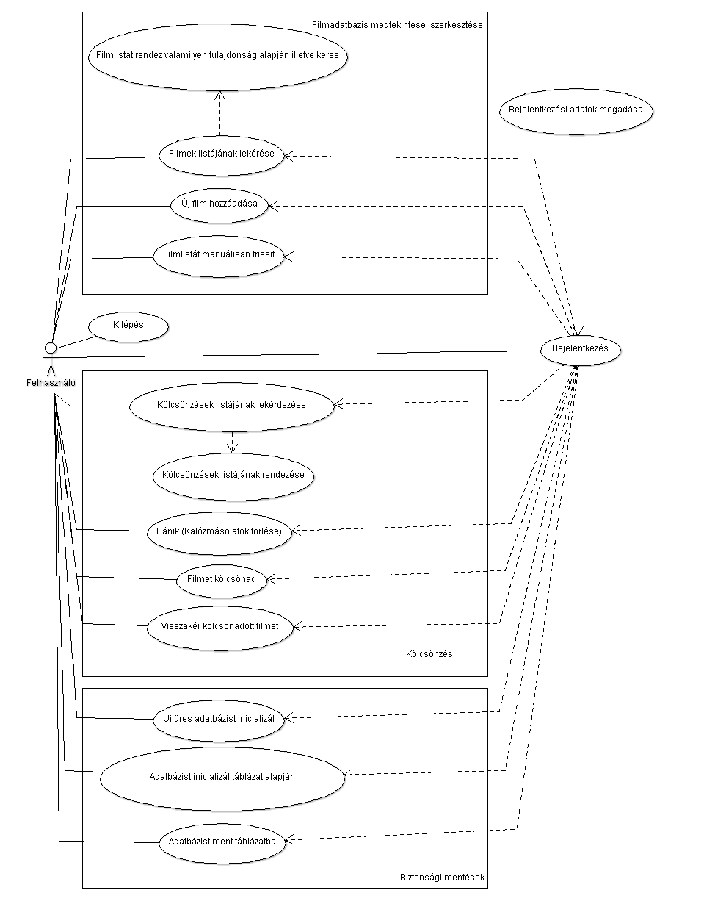

#Documentation
###### Győri Sándor -  AQV5AK
###### alexaegis@gmail.com

##Movie Repository (4. feladat)

##1. Bevezetés
 - A program grafikus felület segítségével enged kezelni egy filmeket nyilvántartó adatbázist. 
 Könnyű keresést és rendezési lehetőségeket biztosít a felhasználó személyes  filmjeihez. 
 Emelett lehetséges vele számontartani filmjeink állapotát úgy mint annak eredetisége és, 
 hogy kinek a birtokában van éppen.  Valamint egy biztonsági funkció segítségével az összes 
 kalózmásolat adatait gyorsan törölhetjük az adatbázisból. Új filmeket, és új kölcsönbeadási 
 eseményeket is felvehetünk melyeket a program az adatbázisban rögzít.
 
##2. Feladatleírás

Készítsünk programot, amellyel otthoni adathordozón lévő filmjeinket tudjuk nyilván tartani az
alábbi funkciókkal:
- Készítsünk egy egyszerű kliens Cache komponenst amely ideiglenes tárolóként
szolgál az adatbázis és az implementált alkalmazás között, a betöltött adatokat tárolja
és egy háttérszálon keresztül megadott időközönként letölti az adatbázisból az utolsó
menet óta létrehozott illetve módosított rekordokat.
- Ezen változásokat jelenítsük meg a megfelelő helyen. (feltételezhetjük, hogy egy adat
szerkesztése közben soha nem módosul az adatbázisban).
- A felhasználói felületen helyezzünk el egy gombot, amely a frissítést azonnal kiváltja.
- A programban megtekinthetőek a filmek egy listában, amelyben tetszőlegesen
kereshetünk cím és/vagy évszám alapján (cím esetén töredékekre is).
- Lehetőségünk van új film felvételére a cím, rendező(k), főszereplő(k), megjelenési év,
valamint az eredetiség (eredeti/kalózmásolat) megadásával. A program figyelmeztet,
ha ugyanezekkel a paraméterekkel már megadtunk egy filmet.
- A filmeket kölcsönadhatjuk barátainknak a film kiválasztásával, valamint a név, a
dátum és a lejárat megadásával. Amennyiben kalózmásolatot adunk kölcsön, a
program figyelmeztessen, és kérjen megerősítést. A program jelenítse meg a lejárt
kölcsönzéseket, és ezt a listát folyamatosan tartsa karban egy háttérszál
segítségével.
- A kölcsönzéseket listázhatjuk (név, dátum), és a listát szűkíthetjük dátum, illetve
név(töredék) megadásával.
- A kölcsönadott filmeket természetesen vissza lehet hozni. A listában külön emeljük ki
(pl. más színnel) azokat a filmeket, amelyeket kölcsönadtunk. Külön oszlopban
jelenítsük meg, összesen hányszor adtuk kölcsön az adott filmet.
- A programban legyen egy PÁNIK gomb is arra az esetre, ha jön a szoftverrendőrség.
Ez a gomb azonnal kitöröl minden olyan filmmel kapcsolatos információt, amely
kalózmásolat.
- Az adatbázis az alábbi adatokat tárolja (ezek még nem feltétlenül a fizikai adattáblák):
    - filmek (cím, rendező(k), főszereplő(k), megjelenés éve, eredetiség)
    - kölcsönzések (film, név, dátum)

##3. Követelményelemzés
- A program bizonyos komponensei külső csomagokat használnak segítségül, ezeket a 
dependenciákat a Maven Central Repository-ból fogjuk beszerezni, a programot pedig 
Maven segítségével fogjuk buildelni.
- A programnak egy mySQL adatbázis kell kezelnie, ehhez JDBC kapcsolatot fogunk használni.
Driverként meg a com.mysql.cj.jdbc.Driver-t fogjuk használni ami a mysql.mysql-connector-java
dependecia fog szolgáltatni.
Emellett pedig opcionálisan lehetőséget biztosítunk távoli adatbázis kezelésére is 
SSH csatornán keresztül, ehhez a com.jcraft.jsch csomagot fogjuk használni.
-

##4. Use Case
- Általános felhasználás

##5. User Stories

#### Filmlistával kapcsolatos User Story-k

<table>
  <tr>
    <th>1</th>
    <th>Bejelentkezés, adatbáziskapcsolat létesítése</th>
  </tr>
    <tr>
    <td>Actor</td>
    <td>Vendég</td>
  </tr>
  <tr>
    <td>Előfeltétel</td>
    <td>Nincs adatbáziskapcsolat</td>
  </tr>
  <tr>
    <td>Sikertelen Eredmény</td>
    <td>A vendég újból megpróbálkozhat a bejelentkezéssel</td>
  </tr>
  <tr>
    <td>Sikeres Edemény</td>
    <td>A vendég felhasználóvá lép elő, hozzáfér a megadott adatbázishoz, a program további funkcióihoz</td>
  </tr>
  <tr>
    <td>Kiváltja</td>
    <td>A vendég a "Csatlakozás/Connect" gombra kattintott a "Kapcsolat/Connection" menüben</td>
  </tr>
  <tr>
    <td>Események</td>
    <td>
        <ol>
            <li>A felhasználó megváltoztatja az alapértelmezetten felajánlott adatokat</li>
            <ul>
                <li>adatbázis címe (alapértelmezett: mysql.caesar.elte.hu)</li>
                <li>portja (alapértelmezett: 3306)   </li>
                <li>felhasználóneve </li>
                <li>jelszava</li>
            </ul>
            <li>Beállítja, hogy szeretne e SSH portforwardingot amennyiben távoli adatbázist kíván elérni</li>
                        <ul>
                            <li>kapcsolat címe (alapértelmezetten caesar.elte.hu)</li>
                            <li>portja (alapértelmezetten 22)</li>
                            <li>továbbítás célja (alapértelmezetten 127.0.0.1)</li>
                            <li>portja (alapértelmezetten 22)</li>
                            <li>felhasználóneve</li>
                            <li>jelszava
                        </ul>
            <li>A "Kapcsolódás/Connect" gomb megnyomása után a program megkísérel bejelentkezni a megadott 
            adatokkal az adatbázisba, amennyiben sikerül a filmlista azonnal megjelenik a képernyőn és minden 
            további funkció elérhetővé válik.</li>
            <li>Sikertelen bejelentkezés esetén az okot egy előugró ablakban közöljük a felhasználóval 
            majd lehetősége van újbóli kísérletre</li>
        </ol>
  </tr>
  <tr>
    <td>Kiegészítés</td>
    <td>A bejelentkezés követelményei:
        <ul>
            <li>Nem helyi cím esetén internetkapcsolat</li>
            <li>A port mezők csak számokat tartalmazhatnak</li>
        </ul>
    </td>
  </tr>
</table>

<table>
  <tr>
    <th>2</th>
    <th>Filmlista frissítése/lekérése</th>
  </tr>
    <tr>
    <td>Actor</td>
    <td>Felhasználó</td>
  </tr>
  <tr>
    <td>Előfeltétel</td>
    <td>Adatbáziskapcsolat</td>
  </tr>
  <tr>
    <td>Sikertelen Eredmény</td>
    <td>A felhasználó értesítést kap a sikertelen adatlekérésről</td>
  </tr>
  <tr>
    <td>Sikeres Edemény</td>
    <td>Megjelenik a filmlista annak 5 oszlopával az alábbi sorrendben 
    alapértelmezetten a Cím szerint rendezve:
    <ul>
    <li>Cím</li>
    <li>Rendezők listája</li>
    <li>Főszereplők listája</li>
    <li>Megjelenés dátuma</li>
    <li>Eredetiség</li>
    </ul>
    </td>
  </tr>
  <tr>
    <td>Kiváltja</td>
    <td>A vendég sikeresen csatlakozott az adatbázishoz, vagy a "Kapcsolat/Connection" menüben
        a "Frissítés/Update" gombra kattintott</td>
  </tr>
  <tr>
    <td>Események</td>
    <td>
        <ol>
            <li>A felhasználó lekérést intéz az adatbázissal szemben</li>
            <li>Az adatok megjelennek a képernyőn</li>  
        </ol>
  </tr>
</table>

<table>
  <tr>
    <th>3</th>
    <th>Filmlista rendezése, keresés a listában</th>
  </tr>
    <tr>
    <td>Actor</td>
    <td>Felhasználó</td>
  </tr>
  <tr>
    <td>Előfeltétel</td>
    <td>Megjelenített filmlista</td>
  </tr>
  <tr>
    <td>Sikertelen Eredmény</td>
    <td>Nincs megjeleníthető információ a képernyőn</td>
  </tr>
  <tr>
    <td>Sikeres Edemény</td>
    <td>A képernyőn a felhasználó szerinti sorrendben, az ő keresőszavaira reagálva jelennek meg</td>
  </tr>
  <tr>
    <td>Kiváltja</td>
    <td>A rendezés az oszlopok neveinek kattintásával érhető el, növekvő illetve második kattintásra csökkenő 
    sorrendben. A keresés pedig a legalsó sorban lévő üres szövegmezőkkel érhetőek el melyek az inputra
    reagálva folyamatosan frissítik a kijelzett filmlistát</td>
  </tr>
  <tr>
    <td>Események</td>
    <td>
        <ul>
            <li>    Rendezés
                    <ol>
                        <li>A felhasználó rákattint a egyik oszlop címére</li>
                        <li>A filmlista a kiválasztott oszlop szerinti növekvő sorrendben rendezésre kerül</li>
                        <li>A felhasználó rákattint az oszlop címére ismét</li>
                        <li>A filmlista a kiválasztott oszlop szerinti csökkenő sorrendben rendezésre kerül</li>
                    </ol>
            </li>
            <li>    Keresés
                    <ol>
                        <li>A felhasználó beírja a keresőszavát az adott oszlop legalsó keresőmezőjébe</li>
                        <li>A filmlista minden egyes új begépelt karakterre frissül és a keresett oszlop szerint
                        rendezésben jelenik meg a képernyőn</li>
                        <li>A felhasználó üresre törli a mezőt a filmlista visszaáll keresés előtti állapotára</li>
                    </ol>
            </li>
        </ul>
  </tr>
</table>

<table>
  <tr>
    <th>4</th>
    <th>Új film hozzáadása</th>
  </tr>
    <tr>
    <td>Actor</td>
    <td>Felhasználó</td>
  </tr>
  <tr>
    <td>Előfeltétel</td>
    <td>Adatbáziskapcsolat</td>
  </tr>
  <tr>
    <td>Sikertelen Eredmény</td>
    <td>Az adatbázisban nem történik változtatás, a felhasználó felugró ablakban értesítést kap a
    művelet sikertelenségéről</td>
  </tr>
  <tr>
    <td>Sikeres Edemény</td>
    <td>A film adatai bekerülnek az adatbázisba, a filmlista frissül az új adatokkal</td>
  </tr>
  <tr>
    <td>Kiváltja</td>
    <td>A felhasználó a "Film hozzáadása/Add movie" gombra kattintott a "Filmek/Movies" menüben majd
    helyes adatokkal a film hozzáadási ablakban a "Hozzáad/Add" gombra kattint</td>
  </tr>
  <tr>
    <td>Események</td>
    <td>
        <ol>
            <li>A felhasználó a "Filmek/Movies" gombra kattint, majd a "Film hozzáadása/Add movie" gombra</li>
            <li>A megjelent ablakban felveszi a megfelelő mezőkbe a film adatait:</li>
            <ul>
                <li>Film címe</li>
                <li>Megjelenésének dátuma (YYYY-MM-DD formátumban)</li>
                <li>A film rendezői (ha több van ';'-vel elválasztva)</li>
                <li>A film főszereplői (ha több van ';'-vel elválasztva)</li>
            </ul>
            <li>Majd "Hozzáad/Add" gombra kattint</li>
        </ol>
  </tr>
  <tr>
    <td>Kiegészítés</td>
    <td>
            A film dátumának megadásának lehetőségét később kibővíthetjük, hogy több formátumban, esetleg 
            hónap, nap nélkül is rögzíteni tudjuk</li>
    </td>
  </tr>
</table>
 
 
#### Kölcsönzésekkel kapcsolatos User Story-k

#### Biztonsági funkciókkal kapcsolatos User Story-k

##6. Nem funkcionális követelmények

